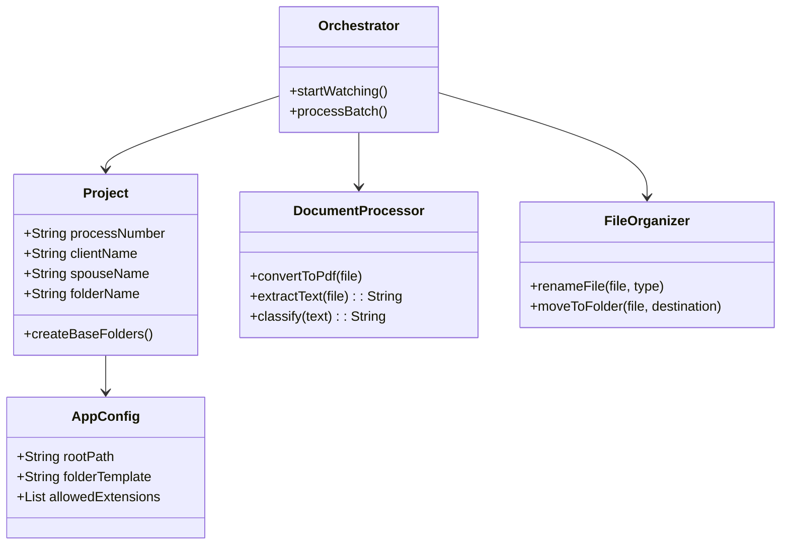
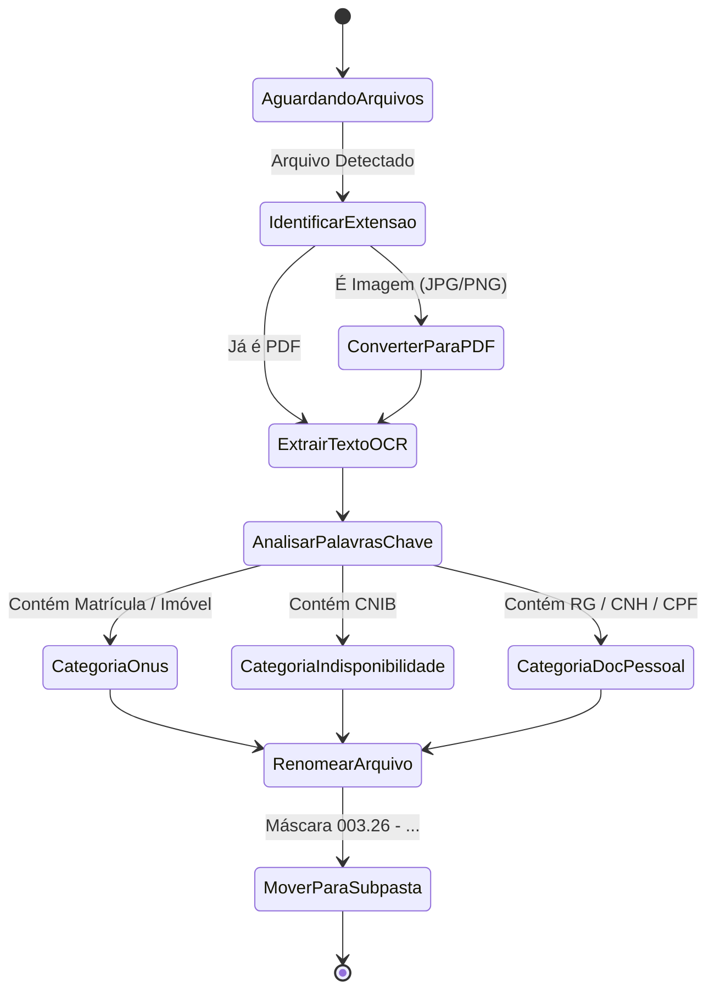

<div align="center">


# 🏛️ Tabulion RPA
### *Software Intelligence for Notary Document Management*

> **"A ponte entre o Direito Notarial e a Engenharia de Software."**

*Transformando a burocracia notarial em um fluxo digital de alta performance.*

<p align="center">
  <a href="#-sobre-o-projeto">Sobre</a> •
  <a href="#-como-funciona">Como Funciona</a> •
  <a href="#-funcionalidades">Funcionalidades</a> •
  <a href="#-arquitetura">Arquitetura</a> •
  <a href="#-tecnologias">Tecnologias</a> •
  <a href="#-como-executar">Instalação</a> •
  <a href="#-autor">Autor</a>
</p>

[](https://python.org)
[](https://customtkinter.tomschimansky.com)
[](https://github.com/tesseract-ocr/tesseract)
[](https://opensource.org/licenses/MIT)
[]()


</div>

---

## 💡 Sobre o Projeto

O **Tabulion RPA** é um software de automação de processos robóticos desenvolvido especificamente para modernizar o dia a dia de **tabelionatos e cartórios**. Ele nasceu da necessidade real de transformar um processo extremamente manual, burocrático e suscetível a erros humanos em um **fluxo de trabalho digital, padronizado e inteligente**.

Pense no Tabulion como um **"assistente digital de alta performance"** que compreende a estrutura interna de um processo notarial e executa o trabalho pesado de triagem, conversão e organização de documentos — automaticamente.

### 🎯 O Problema que Resolve

Em um cartório, cada processo (escritura, inventário, cessão, etc.) exige a coleta e organização de dezenas de documentos: RGs, CPFs, certidões negativas, matrículas de imóvel, comprovantes fiscais. Toda essa triagem é feita **manualmente**, pasta por pasta, arquivo por arquivo, com renomeação manual de cada documento. Isso consome horas da equipe em uma tarefa puramente operacional, que não agrega valor jurídico.

O Tabulion elimina esse gargalo.

---

## ⚙️ Como Funciona

O fluxo de trabalho do Tabulion pode ser descrito em três estágios principais:

```
[Usuário adiciona arquivos] → [Tabulion analisa e classifica] → [Organiza na pasta correta]
```

**1. Entrada:** O usuário abre o software, preenche os dados do processo (número, vendedor, comprador, tipo de escritura) e arrasta os arquivos para a interface (ou os seleciona manualmente).

**2. Processamento Inteligente:** Para cada arquivo, o sistema:
- Converte imagens (JPG, PNG, BMP) para PDF automaticamente
- Executa OCR (reconhecimento óptico de caracteres) para "ler" o conteúdo
- Classifica o documento com base em palavras-chave identificadas (CNH, RG, Matrícula, CCIR, etc.)

**3. Organização:** O arquivo é renomeado seguindo o padrão do cartório e movido para a subpasta correta, dentro da estrutura do processo.

### 📁 Resultado Final no Servidor

```
📦 003.26 - João Luiz - Marcos Santos - Escritura de Venda
│
├── 📂 CERTIDÃO - Indisponibilidade de Bens
│   └── 003.26 - Cert - CNIB - João Luiz.pdf
│
├── 📂 CERTIDÃO - Onus Reais - Registro de Imóveis
│   ├── 003.26 - Doc Imóvel - M 2.657 atl.pdf
│   ├── 003.26 - Doc Imóvel - CCIR.pdf
│   └── 003.26 - Doc Imóvel - ITR.pdf
│
├── 📂 CERTIDÃO - Receita Federal - Estadual - Municipal
│   ├── 003.26 - Cert - Fiscal Federal - João Luiz.pdf
│   └── 003.26 - Cert - Fiscal Estadual - João Luiz.pdf
│
├── 📂 CERTIDÕES - Justiça Federal - Estadual - Trabalhista
│
└── 📂 DOCUMENTOS - Pessoais
    ├── 003.26 - Doc Pessoal - RG - João Luiz.pdf
    ├── 003.26 - Doc Pessoal - Cert Nasc Atl - João Luiz.pdf
    └── 003.26 - Doc Pessoal - CNH - Marcos Santos.pdf
```

---

## ✨ Funcionalidades

### 🖥️ Interface Gráfica (GUI)
- [x] Interface moderna em modo escuro com **CustomTkinter**
- [x] **Drag and Drop** — arraste arquivos diretamente para a janela
- [x] Formulário de dados do processo (vendedor, comprador, tipo de ato, despachante)
- [x] Lista de arquivos selecionados com remoção individual (`❌`)
- [x] Barra de status em tempo real durante o processamento
- [x] **Numeração automática** do processo (lê a pasta de saída e sugere o próximo número)

### 📂 Gestão de Estrutura de Pastas
- [x] Criação automática de hierarquia de pastas com nomenclatura padronizada
- [x] Subpastas padrão geradas automaticamente conforme norma interna do cartório
- [x] Detecção inteligente de pasta já existente (reaproveita sem duplicar)

### 🔄 Conversão e Padronização
- [x] Conversão automática de imagens (`.jpg`, `.jpeg`, `.png`, `.bmp`) para PDF
- [x] Renomeação automática seguindo a máscara `CÓDIGO - TIPO - SUBTIPO - NOME`
- [x] Prevenção de sobrescrita (adiciona contador numérico em arquivos duplicados)

### 🤖 Inteligência Artificial (OCR)
- [x] Extração de texto via **Tesseract OCR** (português)
- [x] Classificação automática por palavras-chave:
  - `CNH`, `RG`, `CPF`, `Cert. Nascimento`, `Cert. Casamento` → Documentos Pessoais
  - `CCIR`, `ITR`, `Matrícula`, `Mapa`, `Memorial` → Ônus Reais / Registro de Imóveis
- [ ] Robô de emissão de certidões fiscais (Web Scraping) *(em breve)*
- [ ] Classificador por IA com modelo treinado para documentos notariais *(roadmap)*

### 🚀 Modo Vigilante (CLI)
- [x] Monitoramento automático da pasta de entrada a cada 5 segundos
- [x] Parser de nome de arquivo para identificar código e cliente sem interação humana
- [x] Processamento em lote sem necessidade de interface gráfica

---

## 🏗️ Arquitetura

O projeto foi estruturado seguindo os princípios de **modularidade e separação de responsabilidades** da Engenharia de Software, facilitando manutenção e escalabilidade.

```
Tabulion_rpa/
│
├── 📄 iniciar.py              # Entry point da aplicação GUI
├── 📄 main.py                 # Entry point do modo vigilante (CLI)
├── 📄 requirements.txt        # Dependências do projeto
├── 📄 docker-compose.yml      # Configuração para deploy em servidor
├── 📄 Dockerfile              # Imagem Docker
│
├── 📂 src/
│   ├── 📄 app.py              # Interface gráfica (TabulionApp)
│   ├── 📄 config.py           # Configurações globais e mapa de roteamento
│   │
│   ├── 📂 engine/             # Núcleo da automação
│   │   ├── 📄 folder_manager.py    # Criação e busca de estruturas de pastas
│   │   ├── 📄 file_processor.py    # Conversão, renomeação e movimentação
│   │   └── 📄 ocr_classifier.py    # Leitura e classificação por OCR
│   │
│   └── 📂 utils/
│       └── 📄 auto_number.py       # Geração automática do próximo número de processo
│
├── 📂 entrada/                # Pasta monitorada (modo vigilante)
└── 📂 saida/                  # Pasta de destino dos processos organizados
```

### 📊 Diagrama de Classes



### 🔄 Diagrama de Estados



---

## 🛠️ Tecnologias

<p align="left">
  <a href="https://skillicons.dev">
    
  </a>
</p>

| Categoria | Tecnologia | Finalidade |
|---|---|---|
| **Linguagem** | Python 3.10+ | Core da aplicação |
| **Interface** | CustomTkinter + TkinterDnD2 | GUI moderna com drag & drop |
| **OCR** | Pytesseract + Tesseract Engine | Leitura e classificação de documentos |
| **Imagem** | Pillow + img2pdf | Abertura e conversão de imagens para PDF |
| **PDF** | pdf2image | Conversão de PDF para imagem para OCR |
| **Automação** | Pathlib + Shutil | Manipulação de arquivos e pastas |
| **Deploy** | Docker + Docker Compose | Execução em servidor sem interface gráfica |

---

## 🚀 Como Executar

### Pré-requisitos

- Python 3.10+
- [Tesseract OCR](https://github.com/UB-Mannheim/tesseract/wiki) instalado no sistema
- Poppler instalado (para o `pdf2image`)

### Instalação

```bash
# 1. Clone o repositório
git clone https://github.com/seu-usuario/tabulion-rpa.git
cd tabulion-rpa

# 2. Instale as dependências
pip install -r requirements.txt
```

### Executando a Interface Gráfica

```bash
python iniciar.py
```

### Executando o Modo Vigilante (Servidor / CLI)

```bash
python main.py
```
> Coloque arquivos na pasta `entrada/` seguindo o padrão:
> `003.26 - Doc pessoal - RG - João Luiz.pdf`
> O sistema os processará automaticamente a cada 5 segundos.

### Deploy com Docker

```bash
docker-compose up -d
```

---

## 🗺️ Roadmap

- [x] Estrutura modular base
- [x] Interface gráfica com CustomTkinter
- [x] Drag & Drop de arquivos
- [x] Conversão JPG → PDF
- [x] OCR e classificação automática
- [x] Numeração automática de processos
- [ ] Robô de emissão de certidões fiscais (Selenium)
- [ ] Integração com banco de dados SQLite para histórico de processos
- [ ] Relatório de processamento em PDF
- [ ] Classificador com modelo de IA fine-tuned para documentos notariais
- [ ] Painel web para acesso remoto

---

## 👨‍💻 Autor

<table>
  <tr>
    <td align="center">
      <b>Jeferson</b><br/>
      <sub>Estudante de Engenharia de Software · Substituto Notarial</sub><br/><br/>
      <i>"Uma ponte entre a tradição dos cartórios e a inovação da tecnologia."</i>
    </td>
  </tr>
</table>

Este projeto faz parte da iniciativa **[iniciando.dev](https://iniciando.dev)** — documentando minha transição de carreira e evolução como desenvolvedor, unindo minha experiência prática como substituto notarial com a Engenharia de Software.

[](https://linkedin.com/in/jefersonbraineleal)
[](https://github.com/jefersonbraine)

---

<div align="center">

**Tabulion RPA** — Construído com ☕ e propósito no Brasil.

*"A fé pública merece tecnologia de ponta."*

</div>
